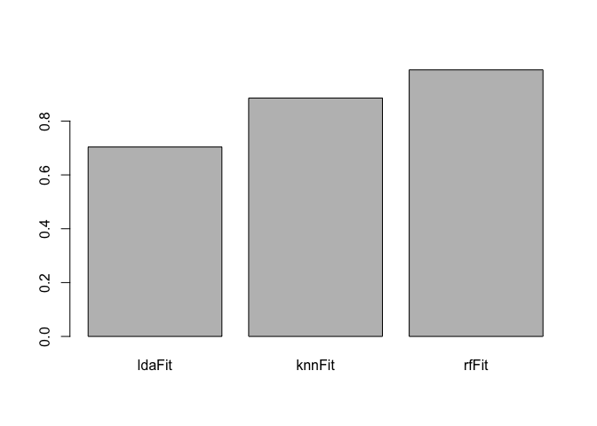

Prediction Assignment Writeup
================

`Author: Hebert Ladera Castillo`

Practical Machine Learning - Prediction Assignment Writeup
----------------------------------------------------------

### Summary

This project tries to predict the manner (`classe`) in which 6 individuals exercised, using data from accelerometers on the belt, forearm, arm, and dumbell. Based on the other available variables on the training data set, I'll use my prediction model to predict 20 different test cases on the testing data set.

### Setting up environment

``` r
library(caret)
library(rpart)
library(randomForest)
set.seed(2021)
```

### Loading and exploring data

``` r
# Loading data
trainingUrl <- 'https://d396qusza40orc.cloudfront.net/predmachlearn/pml-training.csv'
testingUrl <- 'https://d396qusza40orc.cloudfront.net/predmachlearn/pml-testing.csv'
trainingFile <- 'pml-training.csv'
testingFile <- 'pml-testing.csv'

readRemoteFile <- function(url, destFile) {
  if(!file.exists(destFile)) {
    download.file(url, destfile = destFile)
  }
  read.csv(destFile)
}

pmlTrain <- readRemoteFile(trainingUrl, trainingFile)
pmlTest <- readRemoteFile(testingUrl, testingFile)
rm(trainingUrl, testingUrl, trainingFile, testingFile, readRemoteFile)
```

#### Exploring and cleaning data

``` r
# Removing columns with no information
relevantColumns <- colSums(is.na(pmlTest)) < nrow(pmlTest)
pmlTest <- pmlTest[,relevantColumns]
pmlTrain <- pmlTrain[,relevantColumns]

# Removing columns with no relevant information for the prediction
pmlTest <- pmlTest[,-c(1:7)] #Maybe this ones are important to keep
pmlTrain <- pmlTrain[,-c(1:7)]
```

At this point both datasets should have the same columns, with exception of `classe` only present in the `pmlTrain` set, all columns are in the right format and all columns have no `NAs`.

### Building model

``` r
# Partitioning the data set in training and testing
inTrain <- createDataPartition(pmlTrain$classe, p = 3/4, list = FALSE)
training <- pmlTrain[inTrain,]
testing <- pmlTrain[-inTrain,]
```

I'll build models with the following algorithms: 1. Linear Discriminant Analysis (LDA) 2. k-Nearest Neighbors (kNN) 3. Random Forest (RF) 4. Boosting (GBM)

By passing the variable `metric` setted as `Accuracy` we estipulate what summary metric will be used to select the optimal model, in this case accuracy.

``` r
# Doing cross-validation 10-fold one time
control <- trainControl(method="cv", number=10, repeats=1)

# Creating several models to compare them later
ldaFit <- train(classe ~ ., data = training, method = "lda", trControl=control, metric = "Accuracy")
knnFit <- train(classe ~ ., data = training, method = "knn", trControl=control, metric = "Accuracy")
rfFit <- train(classe ~ ., data = training, method = "rf", trControl=control, metric = "Accuracy")
```

Let's compare which model has higher accuracy:

``` r
accuracyMeans <- c("ldaFit" = mean(ldaFit$results$Accuracy), "knnFit" = mean(knnFit$results$Accuracy),
                  "rfFit" = mean(rfFit$results$Accuracy))
barplot(accuracyMeans)
```



``` r
rfMeanAccuracy <- mean(rfFit$results$Accuracy) 
```

As we can see the model built with Random Forest algorithm, in this case, is the model whith higher accuracy with a accuracy mean of 0.9901261.

I'm going to predict the testing data and check with the `confusionMatrix` the viability of this models.

``` r
ldaPrediction <- predict(ldaFit, testing)
knnPrediction <- predict(knnFit, testing)
rfPrediction <- predict(rfFit, testing)
#gbmPrediction <- predict(gbmFit, testing)
paste("Linear Discriminant Analysis prediction accuracy: ", confusionMatrix(ldaPrediction, testing$classe)$overall[1])
```

    ## [1] "Linear Discriminant Analysis prediction accuracy:  0.698205546492659"

``` r
paste("k-Nearest Neighbors prediction accuracy: ", confusionMatrix(knnPrediction, testing$classe)$overall[1])
```

    ## [1] "k-Nearest Neighbors prediction accuracy:  0.90905383360522"

``` r
paste("Random Forest prediction accuracy: ", confusionMatrix(rfPrediction, testing$classe)$overall[1])
```

    ## [1] "Random Forest prediction accuracy:  0.993678629690049"

As we can see, the model built with Random Forest predicted correctly about 99% of the `classe`. I'm going to choose this model to predict the classes on `pmlTrain` data set.

Applying the selected model to the test data set
------------------------------------------------

``` r
predict(rfFit, pmlTest)
```

    ##  [1] B A B A A E D B A A B C B A E E A B B B
    ## Levels: A B C D E

The most accurate tested algorithm for this case is the Random Forest.
